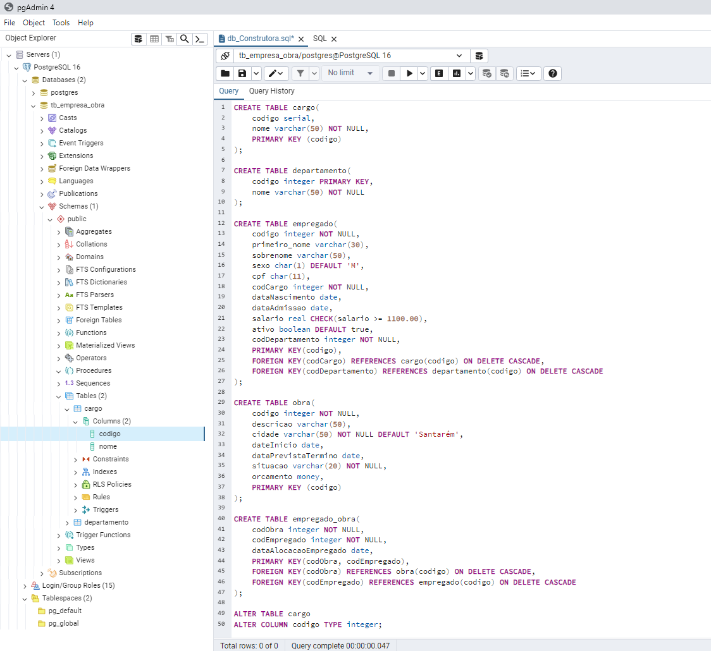

# Banco de dados Relacional

## Sobre o reposítório:

Esse repositório foi criado com o objetivo de armazenar minhas produções realizadas durante a disciplina de Banco de Dados, cursada no 4º semestre do meu curso de Sistemas de Informação na Universidade Federal do Oeste do Pará, ministrada pela professora Socorro Vânia Alves.

## Produções

Esse foi meu primeiro código escrito em SQL utilizando o ambiente pgAdmin do Posthgree. Ele foi proposto pela professora Socorro Vânia Alves a nós, alunos, para que escrevêssemos e começássemos a ter contato com esse SGDB. Achei divertida e proveitosa a criação do código durante a aula. A professora conseguiu repassar vários conhecimentos iniciais para nós. Veja o código abaixo ou clique na imagem para visualizar o código na íntegra:

